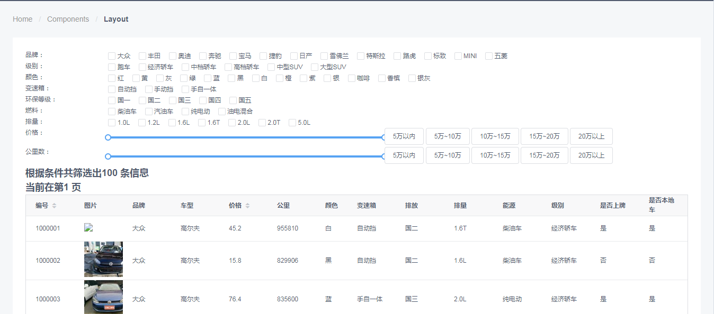
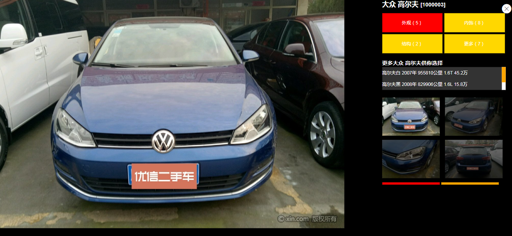

#Cars-Administration
## 技术栈
###### Vue + Vuex + Vue-Router +Iview+Webpack + Mongoose + Node
## 功能实现
- [X] 首页
    - [X] 汽车信息的筛选：可根据汽车的品牌、级别颜色、变速箱、环保等级、燃料、排量，价格和公里数筛选适配汽车
    - [x] 分页——排序，点击页数显示汽车列表
    - [x] 汽车列表，点击汽车图标弹出汽车详情页
- [X] 弹出页面
    - [x] 轮播图组件
    - [x] 汽车详细信息组件，外观、内饰，结构和更多，当前信息高亮
    - [x] 相似车组件
    - [x] 汽车图集组件，当前图集高亮
###### 首页截图

###### 弹出页截图

## 本地运行
```
mongod --dbpath '本地数据库文件路径'
项目服务目录
npm i
node app.js
项目目录
npm i
npm run dev
在浏览器访问127.0.0.1:8080
```
